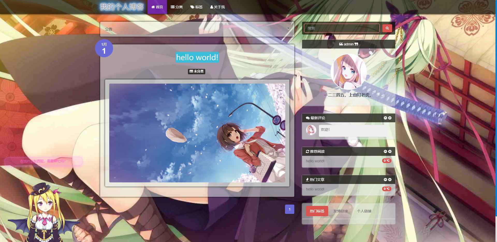
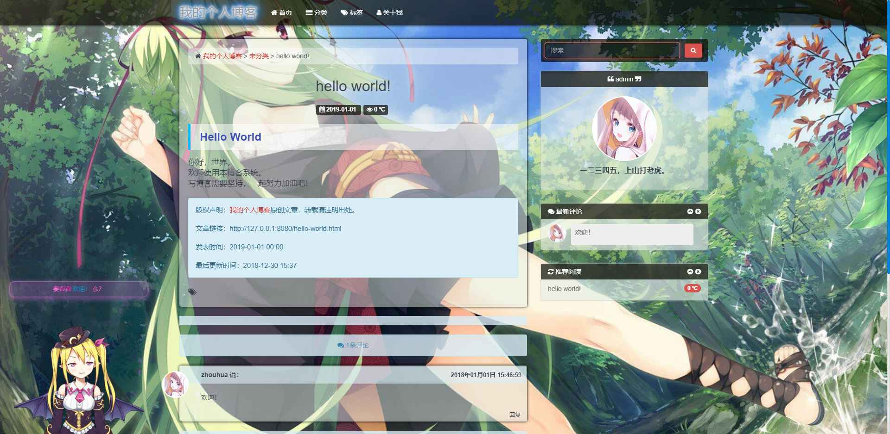
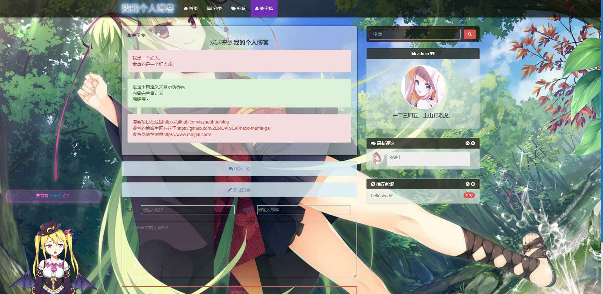
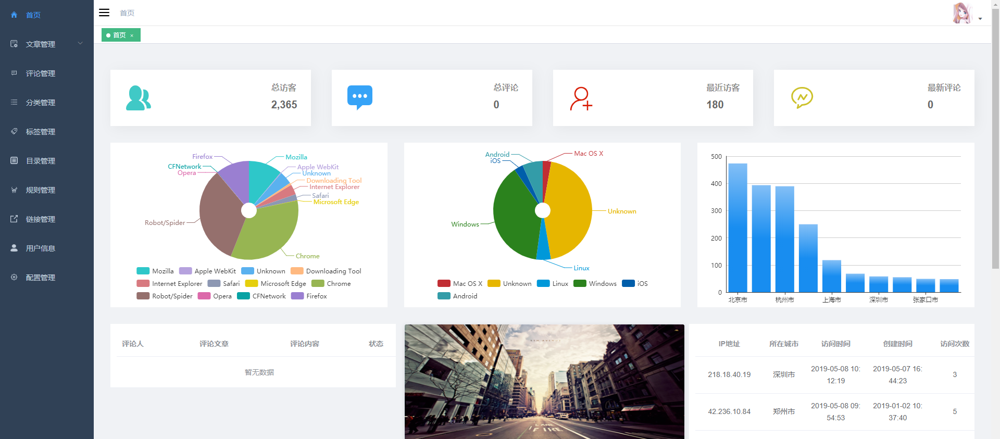
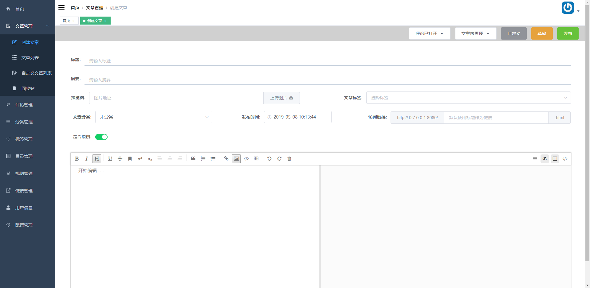
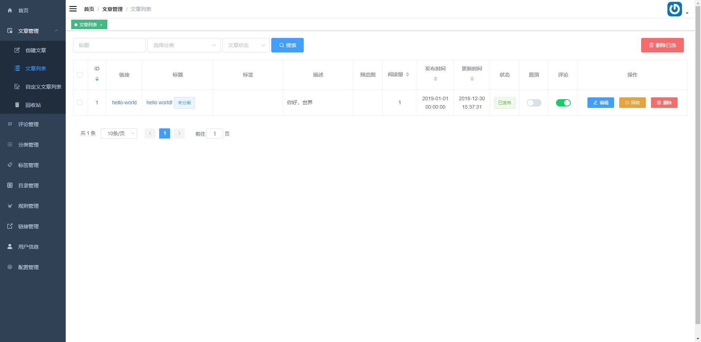
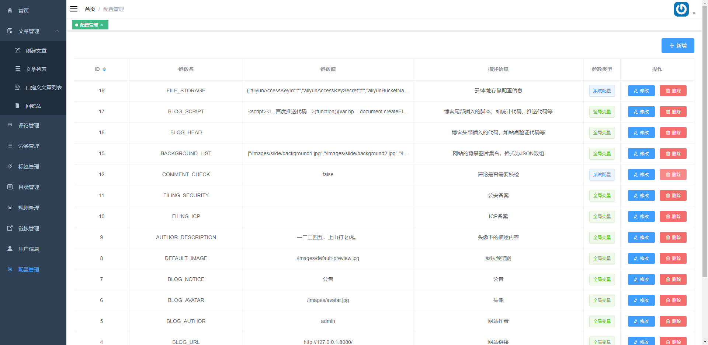
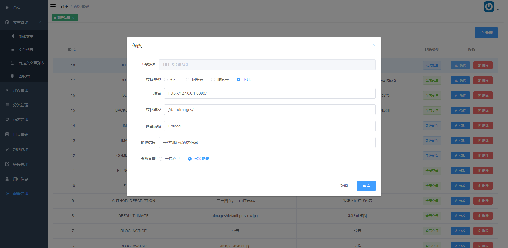

简介
----

基于[SpringBoot](https://github.com/spring-projects/spring-boot)搭建的开源个人博客系统，前台界面基于Hexo主题[hexo-theme-gal](https://github.com/ZEROKISEKI/hexo-theme-gal)进行修改，管理后台界面基于[vue-element-admin](https://github.com/PanJiaChen/vue-element-admin)进行修改。

技术栈：SpringBoot、Thymeleaf、MySQL、MyBatis-Plus、Lombok、Gson、caffeine、validation、Bootstrap、jQuery、FontAwesome、Jsoup……

示例博客：[周华个人博客](https://www.iszhouhua.com)

## 快速开始

1. 下载本项目，并使用IDE打开
2. 新建数据库blog并运行项目
	
	> 现在运行项目会自动运行SQL脚本建表和插入初始数据
3. 修改`application-dev.yml`中的数据库配置信息
4. 运行`BlogApplication.java`，启动项目
5. 浏览器访问`http://127.0.0.1:8080/`

> 使用 Idea，Eclipse 等IDE运行需要安装Lombok插件，JDK版本要求1.8+。

部署
----

### jar部署

配置好`application-prod.yml`中的配置信息，然后打包：

```bash
mvn clean package -Dmaven.test.skip=true
```

将打包好的`blog.jar`和`blog.sh`放到同一文件夹下，执行命令：

```bash
# 使脚本具有执行权限
chmod +x ./blog.sh
# 启动项目
./blog.sh start
# 或者直接使用sh命令运行脚本
sh blog.sh start
```

### tomcat部署

修改`application.yml`中`spring.profiles.active`为`prod`，并配置好`application-prod.yml`中的配置信息。

直接修改`pom.xml`中的打包方式为war后进行打包，或直接运行命令：

```bash
clean package war:war -Dmaven.test.skip=true
```

然后将打包好的`blog.war`丢进tomcat中运行即可！

### docker部署

配置好`application-prod.yml`中的配置信息，然后执行`build-docker.sh`：

```bash
# docker打包
sh build-docker.sh
# 运行项目
docker run -d --name blog -p 8080:8080 --add-host=host.docker.internal:host-gateway -v /data/logs:/app/logs -v /data/upload:/app/src/main/resources/static/upload blog
```
- --add-host=host.docker.internal:host-gateway: 使镜像可通过host.docker.internal连接到宿主机的端口
- -v /data/logs:/app/logs: 日志挂载
- -v /data/upload:/app/src/main/resources/static/upload 上传图片挂载，非本地存储无需挂载

> 注：build-docker.sh脚本会自动将vue代码也编译进docker镜像中，无需单独处理vue的内容

后台管理
--------

后台采用前后端分离的方式实现，源码位于vue文件夹下<https://github.com/iszhouhua/blog/tree/master/vue>

------

其他
--------

有想联系我的，可以加我QQ或微信，备注GitHub(或Gitee)。欢迎大家联系，一起成长，有好的建议和想法可以提供给我。

------


------


------

## 界面展示


















## 2019.5.1 

添加规则管理，转载文章时可直接根据规则自动装配内容。

## 2019.5.8

添加云存储支持，包括七牛云、阿里云、腾讯云。

## 2019.11.5

加入记住密码功能

## 2020.3.5

修改数据库脚本，改为运行时自动运行脚本，方便后续修改数据库结构

## 2020.3.18

修改日志记录，修复无法评论的bug

## 2020.5.27

缓存改用caffeine

## 2020.9.4

很久没看，发现网站被脚本搞挂了。这次改了很多东西，把评论、用户模块重做了一遍。

## 2020.9.10

增加当前登录用户参数注入，修复一些上次改动引起的bug

## 2020.11.28

修复文件流未关闭引起的Too many open files问题

## 2021.4.15

使用flyway进行数据库版本管理，抛弃掉之前的初始化方法

## 2021.6.13

加入获取邮箱验证码功能，支持Gitee和GitHub登录

## 2022.6.26

- 升级ip2region 
- 修改日志记录
- 修复首次运行出错问题
- docker部署方式修改